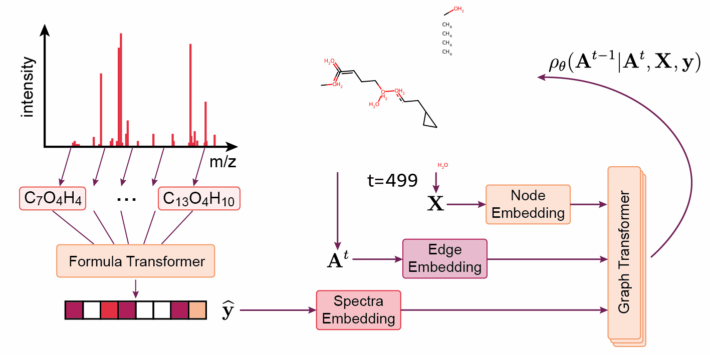

# Annotix ML -- Predict unknown molecular structures from MS/MS spectra using machine learning.

## Installation

Le package est manage par `uv` pour la gestion des dependances entre librairies,
et est installable par `pip`.  
Pour installer le package installer une version de python < 3.13, et run :
`pip install .`.

## Organisation du package

Differentes approches pour la generation de molecules sont contenues dans ce
repo.

### Generation de graphes

La partie etudiant les molecules sous forme de graphes et s'interessant a la
generation de graphes sont contenues dans le paquet `annotix_ml/graphtransf`.

